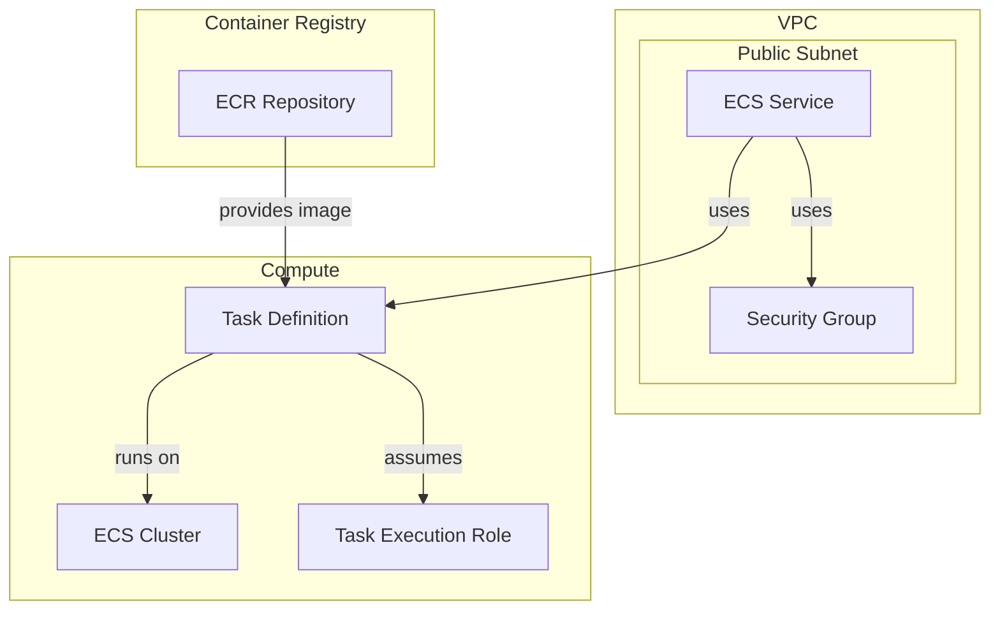

# sample-aws-ecs-deploy-by-github-actions
Github Actions を使って ECS をデプロイするサンプル

## 概要
laravelプロジェクトを、Github Actionsを利用してAWS ECS on Fargateへデプロイしたい。

### 前提条件
- DBはsqlite
- AWSアカウントは取得済み
- web上でAWSリソースを操作するIAMユーザーは作成済み
- AWSリソースの管理はCloudformationとする
- CloudformationはAWS CLIで操作する
- AWS CLIの設定は済み
- RDSは不要

### 考慮対象外
- DBデータの永続化
- 複数コンテナ間のデータ整合性
- バックアップ戦略

## AWSアーキテクチャ



## リソース構成

### ネットワークスタック (`network.yml`)
- VPC
  - CIDR: 10.0.0.0/16
  - Public Subnet: 10.0.1.0/24
  - Internet Gateway
  - Route Table
- Security Group
  - Inbound: 80, 22
- ECR Repository
  - Name: laravel-app
  - Image Scanning: Enabled

### ECSスタック (`ecs.yml`)
- ECS Cluster
  - Name: laravel-ecs-cluster
- Task Definition
  - CPU: 256
  - Memory: 512
  - Network Mode: awsvpc
  - Platform: FARGATE
- ECS Service
  - Desired Count: 1
  - Launch Type: FARGATE
  - Network: Public Subnet

## デプロイ手順

```bash
# 1. ネットワークリソースをデプロイ
./run.sh deploy:network

# 2. Dockerイメージをビルド
./run.sh build

# 3. ECRにイメージをプッシュ
./run.sh push:ecr

# 4. ECSリソースをデプロイ
./run.sh deploy:ecs
```