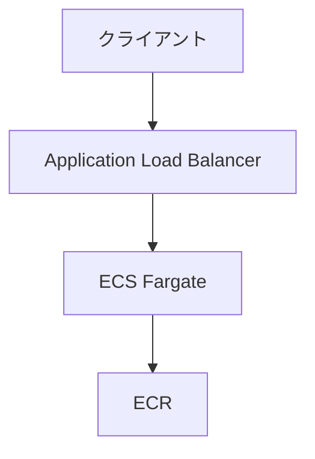

# AWS ECS Deploy by GitHub Actions

GitHub ActionsでAWS ECSにデプロイするサンプル

## System Configuration



## CloudFormation Stacks

- network.yml
  - VPC
  - Subnet
  - Security Group
  - ECR Repository
  - VPCエンドポイント（ECR, CloudWatch Logs用）

- ecs.yml
  - ECS Cluster
  - ECS Task Definition
  - ECS Service
  - Application Load Balancer

## デプロイ手順

```bash
# 1. ネットワークリソースをデプロイ
./run.sh deploy:network

# 2. Dockerイメージをビルド
./run.sh build

# 3. ECRにイメージをプッシュ
./run.sh push:ecr

# 4. ECSリソースをデプロイ
./run.sh deploy:ecs

# 5. アプリケーションのエンドポイントを確認
./run.sh show:endpoint
```

## Tips

### ECSコンテナへのSSM接続

```bash
./run.sh ssm
```
